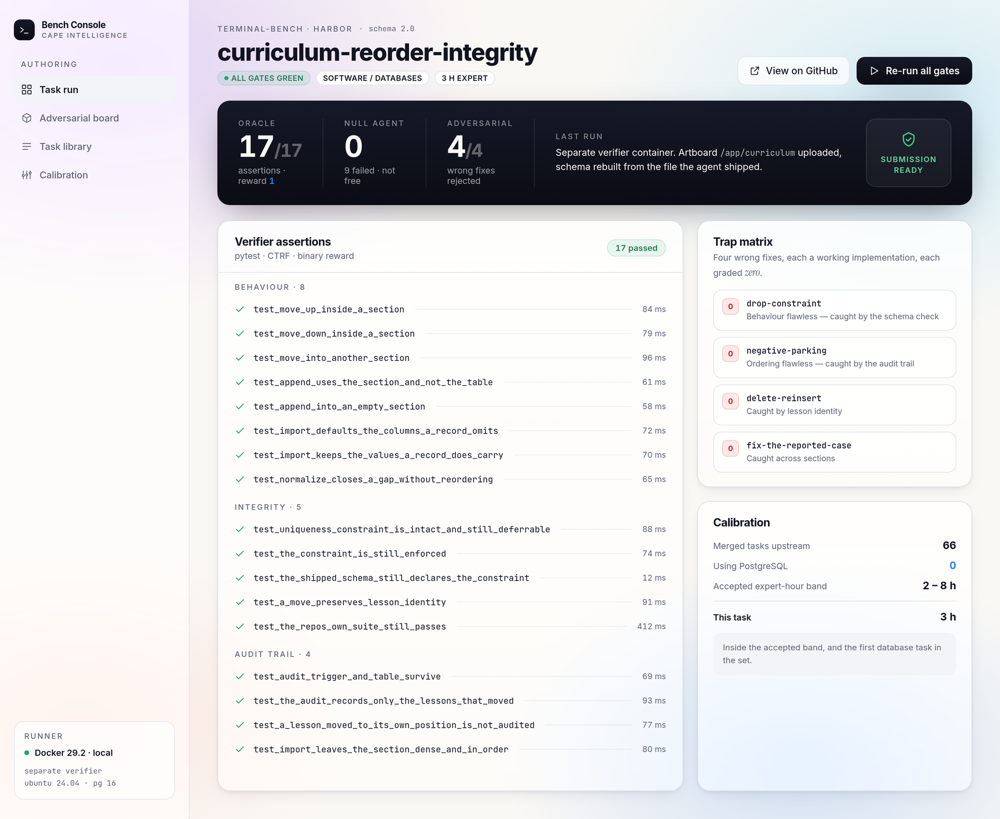
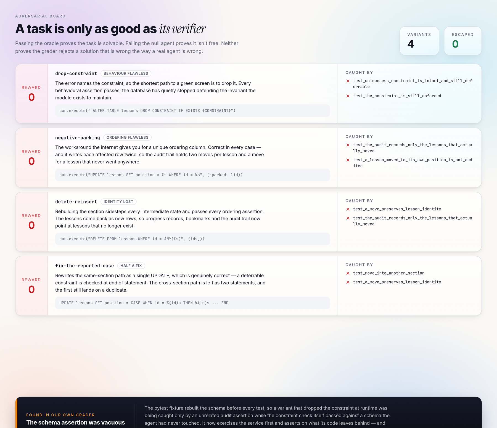
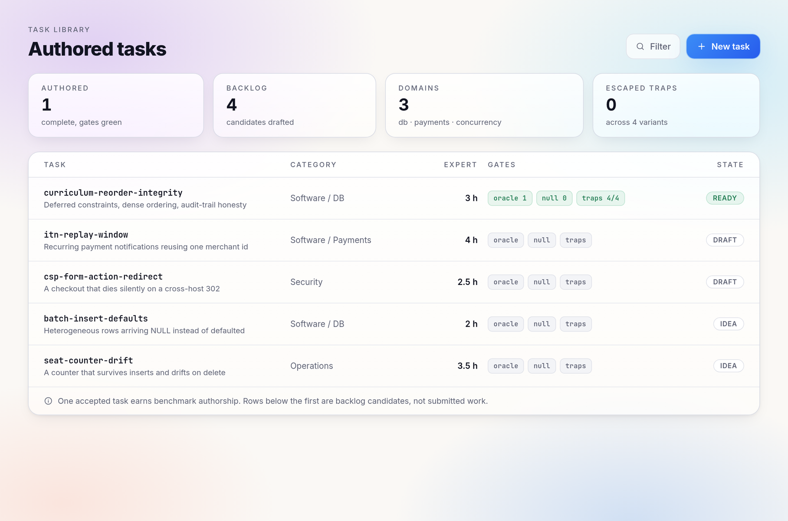

<div align="center">

# curriculum-reorder-integrity

**A Terminal-Bench task — and a verifier that four wrong fixes could not get past.**

[](evidence/null-and-oracle.log)
[](evidence/null-and-oracle.log)
[](evidence/adversarial.log)
[](tasks/curriculum-reorder-integrity/task.toml)
[](tasks/curriculum-reorder-integrity/environment/Dockerfile)

</div>

<br>

<div align="center">
  
</div>

<br>

A single [Terminal-Bench](https://github.com/harbor-framework/terminal-bench) task in the
Harbor format, built to the schema and conventions of the 66 tasks currently merged into
that repository — schema 2.0, a declared artifact list, and a separate verifier container
that receives only those artifacts.

Everything below runs in one command on any machine with Docker.

```bash
./run-local.sh curriculum-reorder-integrity      # null agent, then the oracle
./verify-traps.sh curriculum-reorder-integrity   # the four wrong fixes
```

---

## The task

A Python and PostgreSQL curriculum service is in production and its ordering code is
broken. The agent gets three support reports in plain English — reordering fails, new
lessons land past the end of their section, the legacy import dies — and has to repair the
repository: implementation, tests, debugging, validation.

It is never told where the bugs are, and **the repo's own test suite passes on all three of
them**, so it offers no signal.

|  |  |
|---|---|
| Category | `Software` / `Databases` |
| Environment | Ubuntu 24.04, PostgreSQL 16, Python 3.12 |
| Verifier | separate container, 17 assertions, pytest, CTRF, binary reward |
| Expert time estimate | 3 hours |
| Agent timeout | 8 hours |

The verifier runs in its own image and receives only the artifacts `task.toml` declares —
the isolation every merged task uses. `run-local.sh` reproduces that without Harbor: it
applies a candidate fix inside the agent container, copies the declared artifacts out, and
grades them in the verifier container.

## Why it is hard

The headline bug is not where the error message points.

PostgreSQL checks a `DEFERRABLE INITIALLY IMMEDIATE` constraint at the end of each
**statement**, not per row. So a single `UPDATE` that shifts a run of rows is fine, and the
failure only appears when the shift is split across two statements that each have to land
valid on their own. Dragging a lesson *up* works. Dragging it *down* raises a duplicate key
error — same function, same data, same call. An agent that reads that error as a collision
in the arithmetic will reorder the two statements, watch the reported case go green, and
still be broken across sections.

The two repairs the internet offers both look right and are both wrong here. Dropping the
constraint fixes every behaviour and silently retires the invariant. Parking rows at
temporary negative positions fixes every behaviour and writes each row twice, so a
support-facing audit trail ends up holding two moves for every lesson and a move for a
lesson that never went anywhere.

## Verification

A task is only as good as its verifier. Passing the oracle proves it is solvable; failing
the null agent proves it isn't free. **Neither proves the grader rejects a solution that is
wrong the way a competent agent is wrong.**

So the four plausible wrong fixes ship in [`adversarial/`](tasks/curriculum-reorder-integrity/adversarial),
each one a complete working implementation, and each one is run through the real verifier.

<div align="center">
  
</div>

| Run | Reward | |
|---|:---:|---|
| Oracle (`solution/solve.sh`) | **1** | 17/17 assertions pass |
| Null agent (no changes) | **0** | 9 assertions fail |
| `drop-constraint` | **0** | every behavioural assertion passes — caught only by the schema check |
| `negative-parking` | **0** | ordering is perfect in every case — caught only by the audit trail |
| `delete-reinsert` | **0** | ordering is perfect — caught by lesson identity |
| `fix-the-reported-case` | **0** | fixes the reported case correctly — caught across sections |

Two of those catches are the whole point: a variant that is **behaviourally flawless** still
scores zero, because the task's real requirement is an invariant the behaviour doesn't
reveal.

Captured output is in [`evidence/`](evidence) — `null-and-oracle.log` and `adversarial.log`.

### The verifier was wrong once, too

The first version of the schema assertion was vacuous. The pytest fixture rebuilds the
schema before every test, so `drop-constraint` was being caught by an unrelated audit
assertion while the constraint check itself passed against a schema the agent had never
touched.

The fix was to exercise the service first and assert on the schema the agent's own code
leaves behind, plus a check that `schema.sql` still declares the constraint deferrable.
That is what the adversarial suite is for: it found a hole in the grader, not in the task.

## Calibration

Read before deciding this was worth submitting at all:

- Expert time across the 66 merged tasks runs **0.75 to 60 hours**, with the bulk between 2
  and 8. This task is 3.
- **None of the 66 uses PostgreSQL.** Databases are an open domain in a set whose
  maintainers have asked for broader coverage.

<div align="center">
  
</div>

## Layout

```
tasks/curriculum-reorder-integrity/
├── instruction.md          # what the agent is told: three support reports
├── README.md               # difficulty, solution and verification write-up
├── task.toml               # Harbor metadata and artifact declaration
├── environment/
│   ├── Dockerfile          # Ubuntu 24.04 + PostgreSQL 16 + Python
│   └── repo/               # the service under repair, as a git checkout
├── solution/
│   ├── solve.sh            # oracle
│   └── fixed/              # the reference implementation
├── tests/
│   ├── Dockerfile          # the separate verifier image
│   ├── test.sh             # verifier entrypoint, writes CTRF + reward
│   └── test_state.py       # 17 assertions
└── adversarial/            # four wrong fixes, each proven to score 0
```

The console screens above are a design study of the authoring workflow, not a shipped
application — the numbers in them are this repository's real output.

## Author

**Rasool Abrahams** — Cape Intelligence.
Production web platforms on PostgreSQL. Both defects in this task are drawn from live
systems: a deferred-constraint reordering path, and a batch import that wrote NULLs where
defaults were expected.
